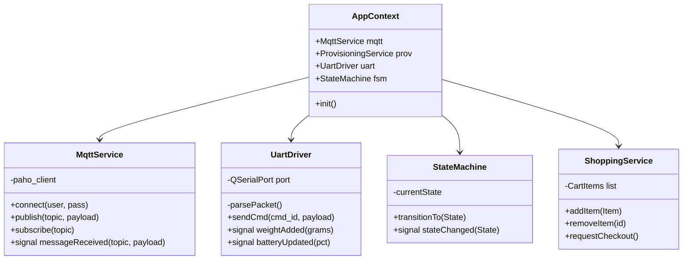
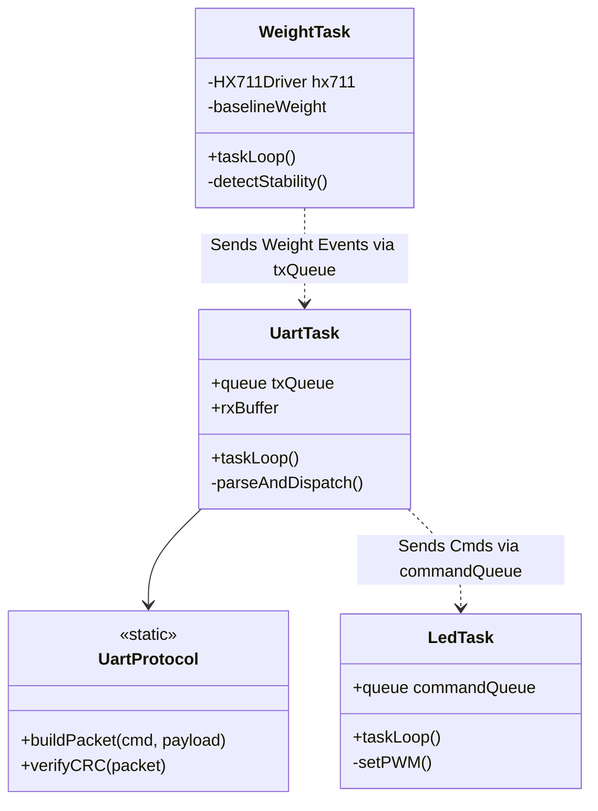

# Class Diagrams

## 1. Qt Edge Application (C++)

```mermaid
classDiagram
    class AppContext {
        +MqttService mqtt
        +ProvisioningService prov
        +UartDriver uart
        +StateMachine fsm
        +init()
    }

    class MqttService {
        -paho_client
        +connect(user, pass)
        +publish(topic, payload)
        +subscribe(topic)
        +signal messageReceived(topic, payload)
    }

    class UartDriver {
        -QSerialPort port
        -parsePacket()
        +sendCmd(cmd_id, payload)
        +signal weightAdded(grams)
        +signal batteryUpdated(pct)
    }

    class StateMachine {
        -currentState
        +transitionTo(State)
        +signal stateChanged(State)
    }

    class ShoppingService {
        -CartItems list
        +addItem(Item)
        +removeItem(id)
        +requestCheckout()
    }

    AppContext --> MqttService
    AppContext --> UartDriver
    AppContext --> StateMachine
    AppContext --> ShoppingService
```

## 2. STM32 Firmware (C/C++)

```mermaid
classDiagram
    class UartTask {
        +queue txQueue
        +rxBuffer
        +taskLoop()
        -parseAndDispatch()
    }

    class WeightTask {
        -HX711Driver hx711
        -baselineWeight
        +taskLoop()
        -detectStability()
    }

    class LedTask {
        +queue commandQueue
        +taskLoop()
        -setPWM()
    }

    class UartProtocol {
        <<static>>
        +buildPacket(cmd, payload)
        +verifyCRC(packet)
    }

    UartTask --> UartProtocol
    WeightTask ..> UartTask : Sends Weight Events via txQueue
    UartTask ..> LedTask : Sends Cmds via commandQueue
```