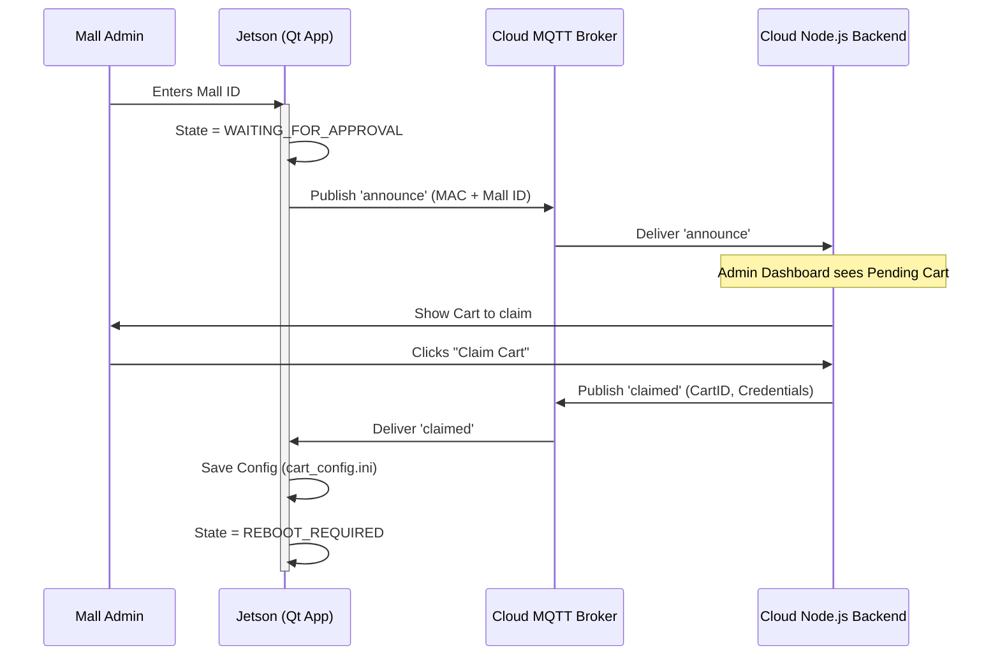
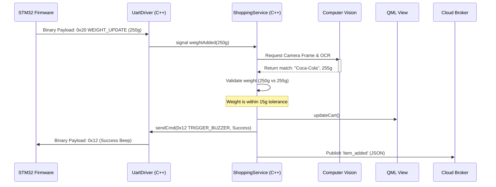
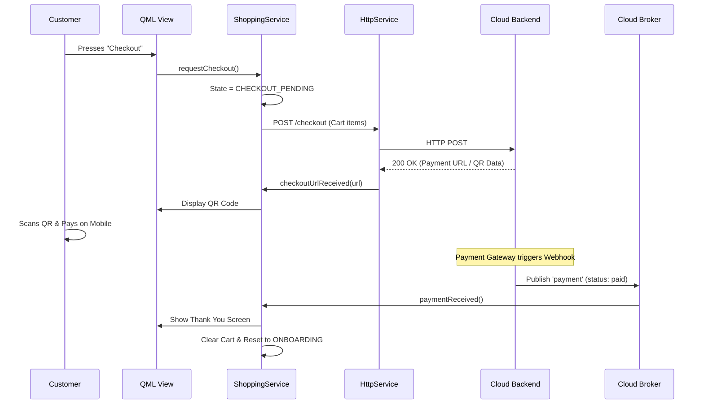

# Sequence Diagrams

## 1. Initial Provisioning Workflow

```mermaid
sequenceDiagram
    participant Admin as Mall Admin
    participant Edge as Jetson (Qt App)
    participant MQTT as Cloud MQTT Broker
    participant Node as Cloud Node.js Backend

    Admin->>Edge: Enters Mall ID
    activate Edge
    Edge->>Edge: State = WAITING_FOR_APPROVAL
    Edge->>MQTT: Publish 'announce' (MAC + Mall ID)
    MQTT->>Node: Deliver 'announce'
    Note over Node: Admin Dashboard sees Pending Cart
    Node->>Admin: Show Cart to claim
    Admin->>Node: Clicks "Claim Cart"
    Node->>MQTT: Publish 'claimed' (CartID, Credentials)
    MQTT->>Edge: Deliver 'claimed'
    Edge->>Edge: Save Config (cart_config.ini)
    Edge->>Edge: State = REBOOT_REQUIRED
    deactivate Edge
```

## 2. Active Shopping Workflow

```mermaid
sequenceDiagram
    participant HW as STM32 Firmware
    participant Uart as UartDriver (C++)
    participant Shop as ShoppingService (C++)
    participant CV as Computer Vision
    participant UI as QML View
    participant Cloud as Cloud Broker

    HW->>Uart: Binary Payload: 0x20 WEIGHT_UPDATE (250g)
    Uart->>Shop: signal weightAdded(250g)
    Shop->>CV: Request Camera Frame & OCR
    activate CV
    CV-->>Shop: Return match: "Coca-Cola", 255g
    deactivate CV
    Shop->>Shop: Validate weight (250g vs 255g)
    Note over Shop: Weight is within 15g tolerance
    Shop->>UI: updateCart()
    Shop->>Uart: sendCmd(0x12 TRIGGER_BUZZER, Success)
    Uart->>HW: Binary Payload: 0x12 (Success Beep)
    Shop->>Cloud: Publish 'item_added' (JSON)
```

## 3. Checkout & Payment Workflow

```mermaid
sequenceDiagram
    participant User as Customer
    participant UI as QML View
    participant Shop as ShoppingService
    participant API as HttpService
    participant Cloud as Cloud Backend
    participant MQTT as Cloud Broker

    User->>UI: Presses "Checkout"
    UI->>Shop: requestCheckout()
    Shop->>Shop: State = CHECKOUT_PENDING
    Shop->>API: POST /checkout (Cart items)
    API->>Cloud: HTTP POST
    Cloud-->>API: 200 OK (Payment URL / QR Data)
    API->>Shop: checkoutUrlReceived(url)
    Shop->>UI: Display QR Code
    User->>User: Scans QR & Pays on Mobile
    Note over Cloud: Payment Gateway triggers Webhook
    Cloud->>MQTT: Publish 'payment' (status: paid)
    MQTT->>Shop: paymentReceived()
    Shop->>UI: Show Thank You Screen
    Shop->>Shop: Clear Cart & Reset to ONBOARDING
```